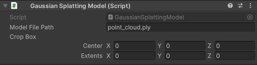

# Gaussian Splatting in Unity

A project to view gaussian splatting in OpenXR in Unity 2022. There is 3 scripts. `GaussianSplatting` is the wrapper to the cuda plugin. `GaussianSlattingCamera` is the script to render gaussian splatting from the camera point of view. `GaussianSplattingModel` is used to load a gaussian splatting model.

## Starting

After cloning the repository and before opening the unity project, download the `default_model.bytes` file in [release](https://github.com/clarte53/GaussianSplattingVRViewerUnity/releases) and copy it to `Assets/GaussianSplattingPlugin` repository just near `default_model.bytes.meta` file.

## Packages
The project use [XR Plugin Management](https://docs.unity3d.com/Packages/com.unity.xr.management@4.4/manual/index.html) and [XR Interaction Toolkit](https://docs.unity3d.com/Packages/com.unity.xr.interaction.toolkit@2.5/manual/index.html) for OpenXR management and XR interaction.

## Scenes
The scene `GaussianSplattingVR` show how to use the gaussian splatting script for VR.

The scene `GaussianSplattingCam` show how to use the gaussian splatting script on multiple camera.

## Gaussian Splatting Script
Gaussian splatting script, use the Gaussian splatting plugin to load and generate texture data for all gaussian splatting models. It has no parameters because all parameters are hold by GaussianSplattingCamera and GaussianSplattingModel scripts.

## Gaussian Splatting Model Script
GaussianSplattingModel, has to be used for all the model you want to load in gaussian.

model file path is the path to load, if file does not exist an error occurs.

Crop Box is the parameter to crop the model, if it's 0 the value will be setted at load by the plugin, if not the value will be used to crop the model.

## Gaussian Splatting Camera Script

This script is used to blit the generated texture by gaussian splatting script to the background of the camera, using left/right texture in VR of only Left texture if VR is not check. It also combine the camera depth with gaussians.

Material have to be a material with "GaussianSplatting/CameraShader" attached. This material is used by `GaussianSplattingCamera` script to put the texture in the background of a camera.

IsXr should be set if the camera is a OpenXR Camera with, both eye. It tell to the script to generate 2 texture and set use the specific VR offscreen projection matrix.

Tex Factor is the factor applied on final camera texture size to do the rendering of gaussian splatting. Adding a Dlss with a 0.5 factor could be a gread idea to improve performance.
