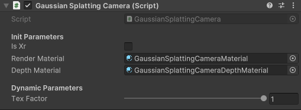

# Gaussian Splatting in Unity

A project to view gaussian splatting in OpenXR in Unity 2022. Actually Gaussian splatting script have to be attached to a camera, it's the main usage, but feel free to develop your own script for different usage.

## Starting

After cloning the repository and before opening the unity project, download the `default_model.bytes` file in [release](https://github.com/clarte53/GaussianSplattingVRViewerUnity/releases) and copy it to `Assets/GaussianSplattingPlugin` repository just near `default_model.bytes.meta` file.

## Packages
The project use [XR Plugin Management](https://docs.unity3d.com/Packages/com.unity.xr.management@4.4/manual/index.html) and [XR Interaction Toolkit](https://docs.unity3d.com/Packages/com.unity.xr.interaction.toolkit@2.5/manual/index.html) for OpenXR management and XR interaction.

## Scenes
The scene `GaussianSplattingVR` show how to use the gaussian splatting script for VR.

The scene `GaussianSplattingCam` show how to use the gaussian splatting script on a single camera.

## Gaussian Splatting Script
Gaussian splatting script, use the Gaussian splatting plugin to load and generate texture data for a gaussian splatting model.

model file path is the path to load, if file does not exist, it load the `default_model`. The default model have to be a 'point_cloud.ply' file with '.bytes' extension.

Material have to be a material with "GaussianSplatting/CameraShader" attached. This material is used by `GaussianSplattingCameraBlit` script to put the texture in the background of a camera.

IsXr should be set if the camera is a OpenXR Camera with, both eye. It tell to the script to generate 2 texture and set use the specific VR offscreen projection matrix.

if TrackTRS is set, the Gaussian splatting object track an other gameobject, it use position, rotation and scale to move the position rotation and scale of the gaussian splatting rendering.

if InitCrop is true, crop min and crop max will be set to Scene min and Scene max at start.

LoadModelEvent, SendInitEvent and SendDrawEvent should be true at start if you want to load, init and draw the model directly.

Renderscale is set by trackTRS if not null, or can be used directly.

Tex Factor is the factor applied on final camera texture size to do the rendering of gaussian splatting. Adding a Dlss with a 0.5 factor could be a gread idea to improve performance.

Crop Min and Crop Max to crop the model.

The others parameters are just information about runtime, nb splats, last api message, real texture size and so on.

## Gaussian Splatting Camera Blit Script

This script is used to blit the generated texture by gaussian splatting script to the background of the camera, using left/right texture in VR of only Left texture if VR is not check.

